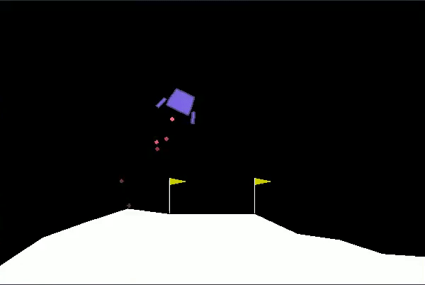
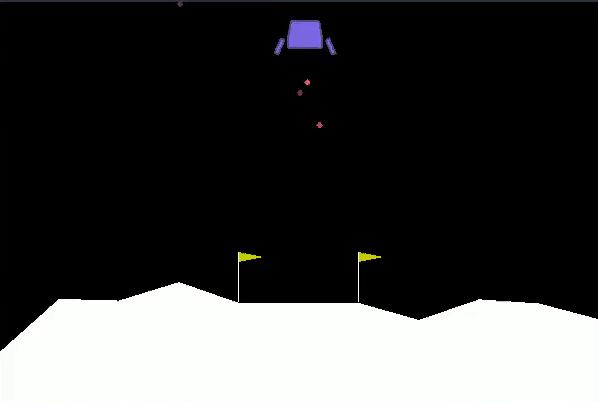

# lunarLanderDQN
Uses a DeepQ Neural Network to play Lunar Lander ([OpenAi Gym](https://gym.openai.com/))

-->[Lunar-Lander-v2 Environment](https://gym.openai.com/envs/LunarLander-v2/)<--

Through a process known as [Reinforcement Learning](https://en.wikipedia.org/wiki/Reinforcement_learning), an Agent is given its current environment in the form of an 
observation. The agent chooses an action from an action space based on this observation. The [DQN](https://en.wikipedia.org/wiki/Q-learning) (DeepQ Network) will 
give a reward based on how well the agent is doing at a given task. (lunar lander in our case)
The agent has memories of what type of reward it got for doing a specific action during a certain observation of its environment.

The agent will use a [epsilon-greedy algorithm](https://medium.com/analytics-vidhya/the-epsilon-greedy-algorithm-for-reinforcement-learning-5fe6f96dc870) to choose the best action it sees fit for an observation based on its memories.

An agents memories are 'wiped' or reset after each episode (epoch) however, the linear neural network remains the same. After 500 episodes 
this lunar lander agent discovered a strategy for landing on the goal platform and can execute it reasonably effectively and consistently.

**Trained Lunar Lander Agent (500 epochs)**  

**Untrained Lunar Lander Agent**  

**Notes**  

The 'goal' platform is always centered at (0,0)
The geometry around the platform will change through each epoch or episode.

[extremely helpful PyTorch video](https://www.youtube.com/watch?v=UlJzzLYgYoE)

took about 25 minutes to train on GTX 1660 TI
