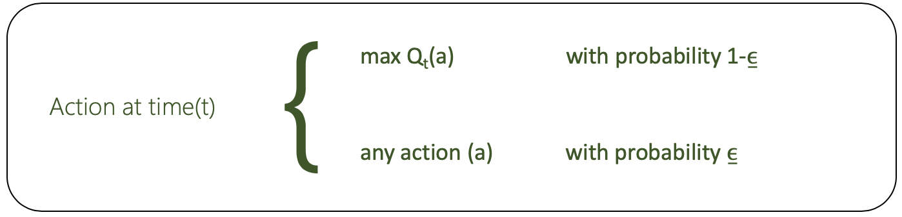
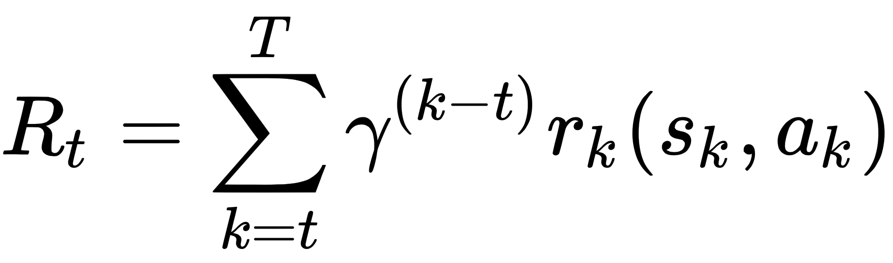
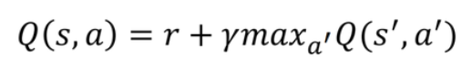

# lunarLanderDQN
A Deep Q-learning neural network is used to master Lunar Lander ([OpenAi Gym])(https://gym.openai.com/envs/LunarLander-v2/)

see another [DQN I made](https://github.com/JustinStitt/cartpoleDQN) with the Cartpole-v1 OpenAi Gym environment

# Agent Progress Visuals

**10 Epochs of training:**

**500 Epochs of training:**

[Deep Q-Learning](https://en.wikipedia.org/wiki/Q-learning#Deep_Q-learning) is a branch of [Reinforcement Learning](https://en.wikipedia.org/wiki/Reinforcement_learning) where Q-Values are
generated based on a discounted future reward given an action and an environment observation.

**Figure showing the feedback loop of a DQN**

As you can see, the Agent performs an action and the environment promptly delivers a discounted future reward estimate as well as the next observation.

# Learning 

**Loss**

A DQN Agent learns by minimizing loss. Loss, sometimes called cost, is determined by some criterion function. For my model, I've chosen [Mean-Squared Error](https://en.wikipedia.org/wiki/Mean_squared_error) (MSE) to calculate loss/cost.

**Gradient Descent and Optimizers**

The network minimizes this loss by using an optimizer that adjusts the networks parameters. 
A [gradient descent policy](http://www.scholarpedia.org/article/Policy_gradient_methods) is the most widely used algorithm by optimizers. 
The optimizer's goal is to find the steepest descent at any given position. Doing this for N episodes with some learning rate, you will --over time-- find some local minima.

**Local Minima and the Journey to Minimizing Loss**

In the optimizer's journey to minimizing loss, it will encounter some local minima in which in may be happy to stay in. However, we usually don't want to settle with the first local minima we find as there is
most definitely a better minima to strive towards. The best, of course, being the global minima which is the best possible position to be in as our loss is as minimal as it can possibly be.

**Learning Rate**

The learning rate will affect how the optimizer gets out of weak local minima. If the learning rate is too low, the network may get stuck in a quite poor
local minima. Moreover, if the learning rate is too high then we may entirely skip over satisfactory local minima or potentially global minima.

**physical reconstruction I made to help myself visualize gradient descent**

Consider a 3D cartesian environment. If our network is at some (x,y) we can then run our loss criterion on Q(x,y)
which will yield some loss/cost value denoted 'z'. If you imagine dropping a ball (our network) randomly onto this physical reconstruction
and watching it roll to the deepest part of the model, then that is essentially what our network optimizer is doing.

# Choosing an Action

**Epsilon-Greedy Algorithm**

An epsilon-greedy algorithm is used to balanced the amount of **exploration** and **exploitation**. At first, the model is initialzied with some starting epsilon value typically 1.0f.
This epsilon is iteratively decreased by some factor after each episode.

**Exploration**

If our random value does not fall within our epsilon probability range then we choose a random action from our action space.
This allows the agent to explore and potentially gather new information.

**Exploitation**

In the scenario where our random value falls within our epsilon probability range then we choose the best possible known action.
This action is determined by doing a forward pass of our current observation through our network. What results is an array of Q-Values predicting
our expected discounted future reward for each action in our action space. We then take the max(Q-Values) and pass the action to our environment and decrement epsilon.

**Why We Decrement Epsilon with Each Time Step**

Epsilon (Ɛ) is decremented after each epoch because as our network evolves and our agent becomes more confident, we want to explore less and less.
If our agent was in a constant state of exploration then we would never make actions that progress our knowledge past pure randomness.

# Determining Reward

**Gamma (γ)**

Rewards are given in terms of predicted future reward. However, we can't be sure or confident that an action taken at
t = 0 has an effect at t = 1500. Therefore, we need to discount our predicted future rewards with some coefficient -- gamma --.

**Compute a Reward for time step t: In Math Terms**

--this reward value feeds into the Bellman equation (below)

**Bellman Equation**

**Example of Why We Need Discounted Future Rewards**

Say you do well on a math quiz. The short-term reward is that your grade in the class will go up. It is quite easy to correlate
this action with said reward. Now, say 3 months later your final grades are posted. How much do you attribute that **one** quiz with your overall class grade?
Less so. Even broader, 4 years later you graduate. What weight do you give to the intial action of doing well on that **one** quiz? Nearly inconsequential...
Goes to show why gamma is used in RL models to discount future rewards.

# References

[OpenAi Gym](https://gym.openai.com/)

[DQN w/ CNN](https://medium.com/analytics-vidhya/deep-q-network-with-convolutional-neural-networks-c761697897df) -- I did not use a CNN in this Lunar Lander model, but nonetheless this resource helped tremendously.

[RL Tutorial](https://www.toptal.com/deep-learning/pytorch-reinforcement-learning-tutorial)

[DQN w/ PyTorch Github Source](https://github.com/philtabor/Deep-Q-Learning-Paper-To-Code)
